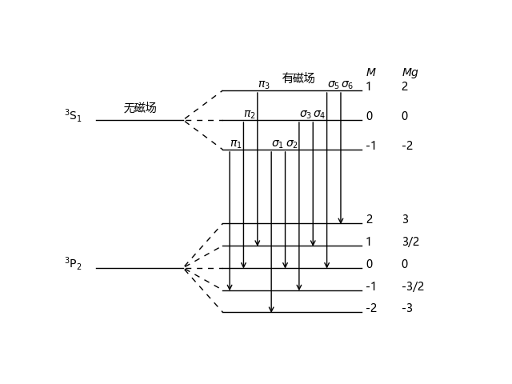
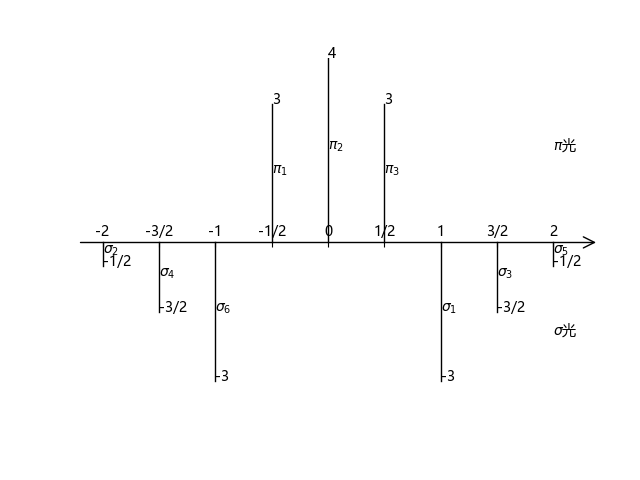

# plot-Zeeman-effect

给定量子数对反常塞满效应的作能级图和子谱线相对强度分布图.

*只有LS耦合, Jj耦合没有写*

## example

以汞灯 546.1 nm, 上能级 $^3S_1$, 下能级 $^3P_2$ 为例

### 能级图

```python
anomalous_Zeeman_effect_split(LSJ1, LSJ2, filename)
```


### 强度分布图
```python
anomalous_Zeeman_effect_intensity(LSJ1, LSJ2, filename)
```
